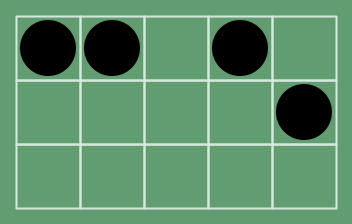
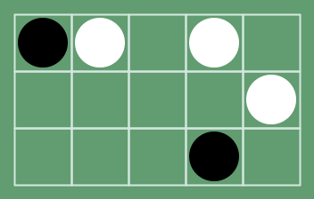

# Cinderblock Solver

## What is Cinderblock?
Cinderblock is a singleplayer game similar to checkers. The game is played on a grid, and each space may contain a piece. There are two types of pieces:

1. Cinders 
2. Dynamos 

Dynamos can jump over any piece just like in checkers. If a dynamo jumps over another dynamo, the one which was jumped over is removed.

Cinders will always remain where they are; they cannot be moved nor removed.

**The end goal of the game is to have one dynamo left on the board**

## How does the solver work?
The solver currently uses simple state enumeration. Starting with the given board, the solver tries every single combination of moves until it finds a solved board. Board states which have been visited before are pruned to save computation time.